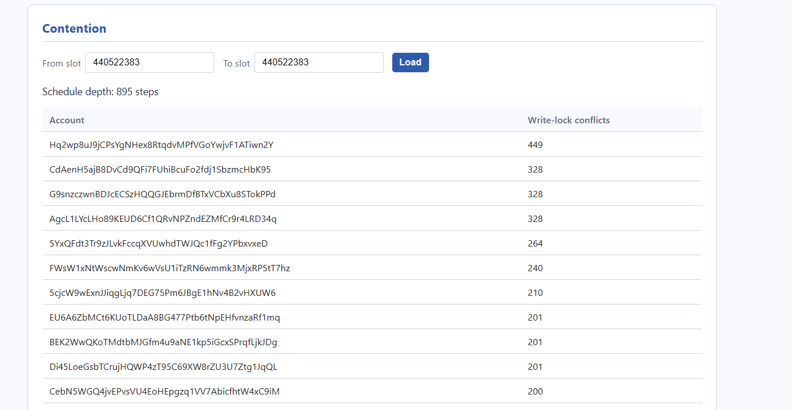
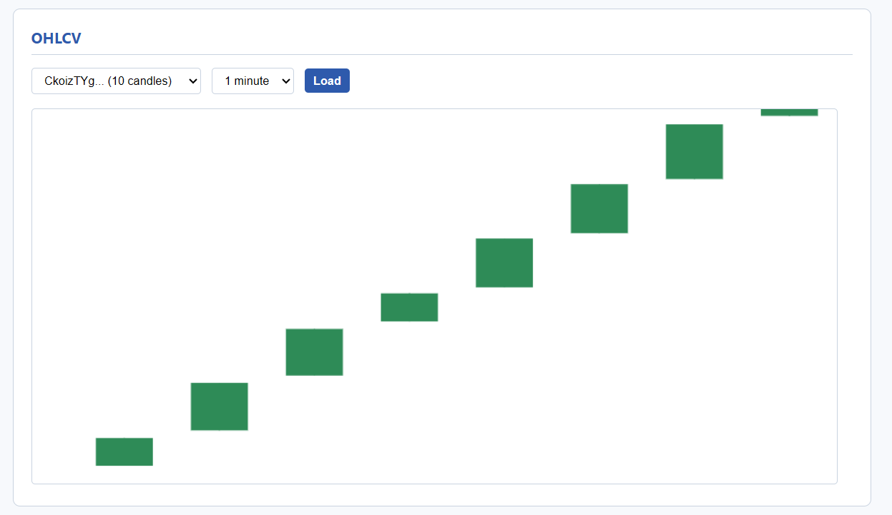

# Rust + Solana Engineering Assignment

Ingest **1,000 consecutive recent Solana slots**, reconstruct a per-block
transaction-conflict schedule, derive **1-minute and 5-minute** OHLCV
candles from transaction metadata only, and serve both over HTTP + a
vanilla-JS dashboard from one process.

## Setup

Requires **Rust 1.85+** (edition 2024). Clone the repo, then:

```
cargo build --release
cargo test
```

On Windows, if `cargo test` hits MSVC `LNK1318` (parallel DuckDB links),
run crates one at a time or `powershell -File scripts\verify.ps1`.

RPC URL (gitignored `.env`):

```
HELIUS_URL=https://mainnet.helius-rpc.com/?api-key=YOUR_KEY
```

The client enforces a **10 req/s token-bucket in our code**
(`ingest-core::TokenBucketLimiter`), independent of whatever the provider
would throttle. Do not use public `api.mainnet-beta.solana.com` for timed
runs — its throttling would contaminate FINDINGS.

## Chosen slot range

| | |
|---|---|
| **Start slot** | `440522383` |
| **End slot (inclusive)** | `440523382` |
| **Count** | **1,000 consecutive** slots |
| **Chosen** | 20 Aug 2026, from finalized `getSlot` **440524383**, minus 2,000 |

The offset behind the tip keeps the whole window in **finalized /
long-term storage**, so leader-skipped and “block not available” noise
at the moving tip does not dominate the run. Re-run:

```powershell
powershell -File scripts\ingest.ps1
```

(`scripts\ingest.ps1` defaults `--start-slot` to `440522383` and
`--count` to `1000`.)

## Run

PowerShell (do **not** use bash `\` line continuation):

```powershell
# ingest the chosen 1,000-slot window
powershell -File scripts\ingest.ps1

# same window + dashboard in this process (Ctrl+C to stop after ingest)
powershell -File scripts\ingest.ps1 -Serve

# serve an existing DB
.\target\release\astralane-assignment.exe serve --db-path astralane.duckdb --port 8080
```

macOS / Linux:

```bash
cargo run --release -- ingest \
  --rpc-endpoint "$HELIUS_URL" \
  --start-slot 440522383 \
  --count 1000 \
  --rate-per-sec 10 \
  --max-concurrency 8 \
  --batch-size 25 \
  --db-path astralane.duckdb

cargo run --release -- serve --db-path astralane.duckdb --port 8080
```

Open http://127.0.0.1:8080 — contention table + 1m/5m candles.
The token dropdown lists **only mints that have stored candles** (not every
mint with a balance-change row). Contention defaults to slot `440522383`.

Dashboard from the finished 1,000-slot ingest:




The 9 GB `astralane.duckdb` from the assignment ingest is **not** in the
submission zip. Replay with `scripts\ingest.ps1`, or `cargo test` for
offline proof. Measured results are in [FINDINGS.md](FINDINGS.md).

## Contention-model assumptions

- **Conflict:** a **write** lock on an account conflicts with any later
  **read or write** on that same account. Two **reads** never conflict.
- **Step:** the position in an order-preserving schedule. Transaction
  `i` is assigned
  `step = 1 + max(blocking step among earlier conflicting locks)`, or
  `0` if nothing blocks it. Depth is `1 + max(step)` (or 0 if no txs).
- **Heuristic, not exact.** The Solana RPC **does not expose the
  validator’s actual execution schedule**. We reconstruct a schedule
  that **preserves original in-block order** (a tx may only start after
  every *earlier* conflicting tx has finished). That answers “how
  parallel could this block realistically have run,” not a
  graph-coloring minimum that ignores block order.

Implementation: `contention::build_schedule`. Tests:
`cargo test -p contention`.

## OHLCV assumptions

- Candles at **1 minute** (`interval_sec = 60`) and **5 minutes**
  (`300`).
- **Transaction metadata only:** `preTokenBalances` / `postTokenBalances`
  (and the analogous native-balance fields where present). No DEX
  instruction decode, no extra RPC.
- Price = opposing SPL-token vs wrapped-SOL (`So111…112`) deltas in the
  **same** successful transaction, decimal-adjusted. Volume in SOL.
- Excluded: wrap/unwrap only, same-direction deltas (LP-like), no wSOL
  leg, dust &lt; `0.0005` SOL, failed txs (`meta.err`).

## Automated tests (assignment-required)

| Requirement | Command |
|---|---|
| Conflict detection | `cargo test -p contention` |
| v0 / ALT account resolution | `cargo test -p ingest-core v0_account_resolution` |
| Candle construction (1m and 5m) | `cargo test -p ohlcv candle` |
| Idempotent ingestion | `cargo test -p storage replacing_the_same_slot_twice_does_not_duplicate_rows` |
| Full offline suite | `cargo test` or `scripts\verify.ps1` |

Load-experiment write-up: [FINDINGS.md](FINDINGS.md). Per-FR commands:
[HOW_TO_TEST.md](HOW_TO_TEST.md).

## Architecture (short)

One binary (`cli`). Fetch → parse → store over bounded `mpsc` (capacity 2,
**block** on send). SQL only in `storage` (DuckDB Appender, delete-then-insert
per slot). `ingest --serve` shares `Arc<Mutex<Connection>>`; `/api/health`
does not take that lock. Rate limit is client-side, 10 req/s.
